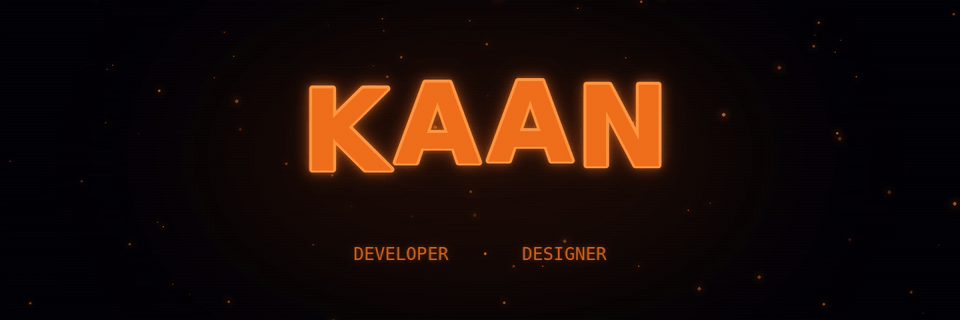
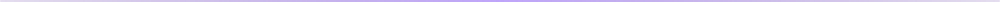

<h1 align="center">
  Hi, I'm Kaan Hamitler
  
</h1>

<p align="center">
  <strong>Frontend Developer · UI-Focused Engineer</strong>
</p>

<p align="center">
  I turn thoughtful design into fast, accessible, and maintainable web interfaces.
</p>

<p align="center">
  
</p>

<p align="center">
  
  
  
  
</p>

<p align="center">
  <a href="https://github.com/Kaan-Developer?tab=followers">
    
  </a>
</p>


## About Me



```typescript
const kaan = {
  role: "Frontend Developer",
  focus: [
    "Product UI",
    "Design Systems",
    "Accessible Interfaces",
  ],
  stack: [
    "React",
    "TypeScript",
    "Tailwind CSS",
  ],
  status: "Open to frontend opportunities",
} as const;Ï
```


## Frontend Stack


<div align="center">

### Core


### Application Layer

<p>
  
  
  
  
  
</p>

### Interface & Workflow


</div>


## AI-Assisted Workflow


<div align="center">

<p>
  
  
  
  
</p>

<sub>
  Used for research, debugging, prototyping, and visual exploration — with every technical decision reviewed and validated.
</sub>

</div>


## Portfolio


<div align="center">

<h3>See the work behind the profile.</h3>

<p>
  Explore selected interfaces, implementation details, and the thinking behind each build.
</p>

<a href="https://YOUR-PORTFOLIO-URL.com">
  
</a>

</div>


## Connect


<div align="center">

<p>Have a role, project, or collaboration in mind? Let's talk.</p>

<a href="https://github.com/Kaan-Developer">
  
</a>
<a href="https://wa.me/90XXXXXXXXXX?text=Hello%20Kaan%2C%20I%20would%20like%20to%20talk%20about%20a%20project.">
  
</a>

<br /><br />

<sub>Türkiye · Open to frontend roles, selected freelance work, and open-source collaboration</sub>

</div>


<div align="center">

<sub>Build with clarity · Ship with purpose · Improve with evidence</sub>

</div>

<!--
BEFORE PUBLISHING:
1. Replace https://YOUR-PORTFOLIO-URL.com with the real portfolio URL.
2. Replace 90XXXXXXXXXX with the WhatsApp number in international format.
3. Keep the assets folder next to README.md or the dividers will not render.
-->
